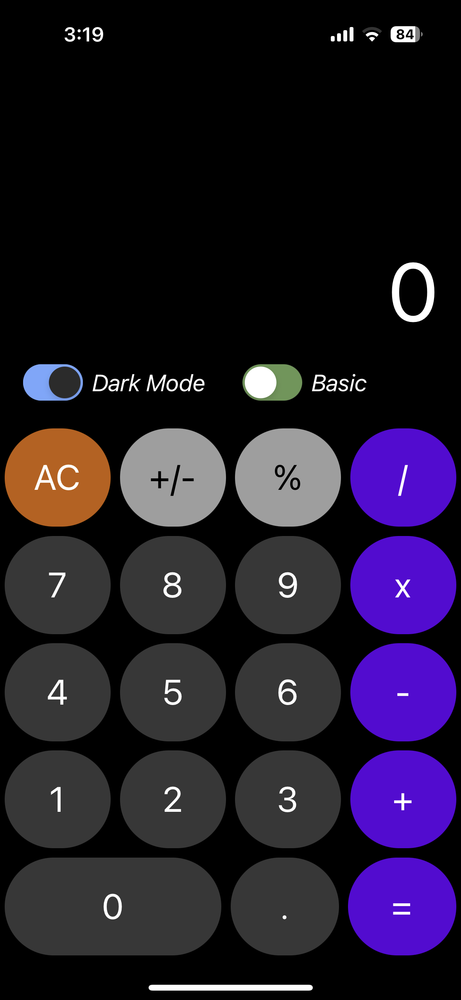
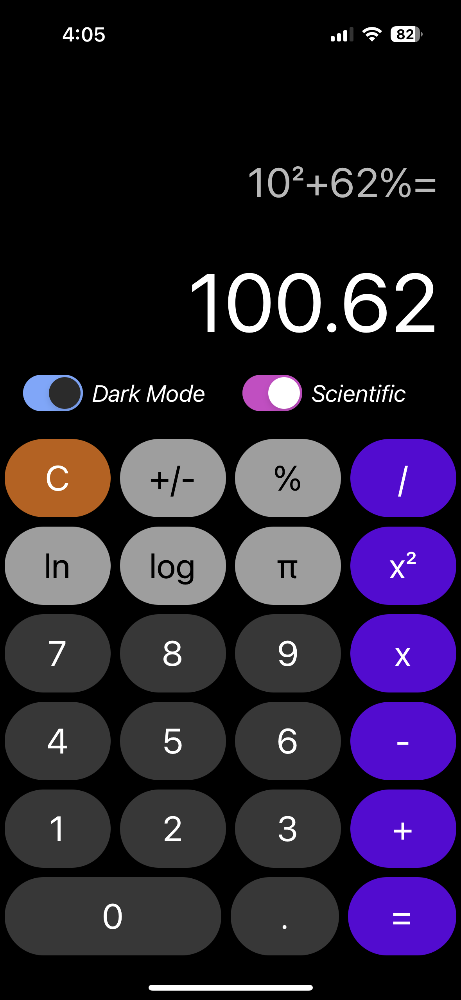
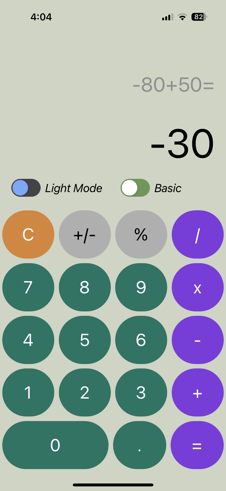
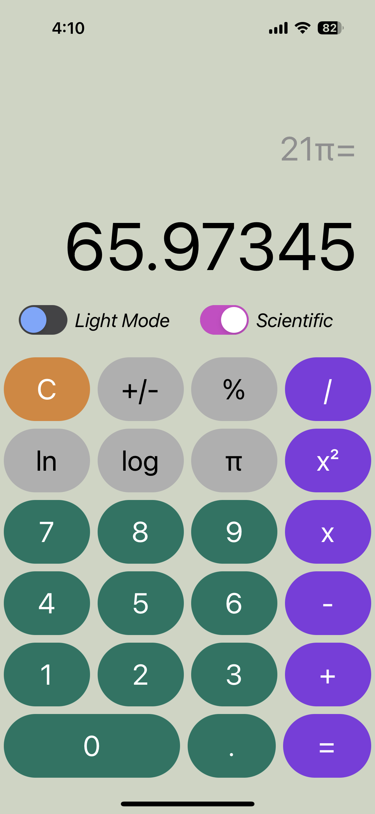

# Calculator App

A simple calculator built using React Native that mimics the design of the default iOS calculator.

## Features

- Basic arithmetic operations: `+, -, x, /`.

- Scientific functions: `ln, log, ^2, π`.

- Switch to show / hide scientific function buttons.

- Switch to toggle between light / dark mode.

## Demo

### Dark mode (default)

Basic

Scientific

### Light Mode

Basic

Scientific

